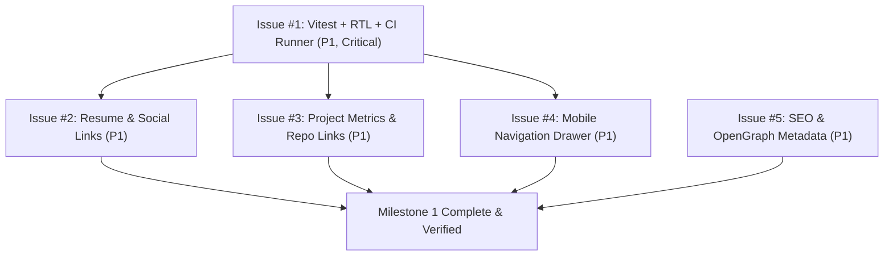

# Project Plan & Roadmap — Personal Website

**Project Name:** Mario Estrada — Personal Engineering Portfolio  
**Vision/Goal:** Elevate Mario's personal portfolio to demonstrate Staff/Senior engineering rigor, architectural depth in distributed systems/cloud backends, and full SDLC best practices governed by the `GEMINI.md` master quality bar.

---

## 1. MoSCoW Prioritization Matrix

Based on stakeholder analysis (Recruiters, Engineering Leads, Open-Source Peers) from [BRAINSTORMING.md](file:///c:/Codigos/Personal-Website/BRAINSTORMING.md):

| Priority | Item | Track | Type | Est. Size | Target Milestone |
|---|---|---|---|---|---|
| **Must-Have (P1)** | [#1: Configure Vitest, React Testing Library, and CI Runner](file:///.github/issues/01-test-infrastructure.md) | C: Engineering Rigor | `chore` | `size: s` | Milestone 1 |
| **Must-Have (P1)** | [#2: Add PDF Resume Action & Professional Social Links](file:///.github/issues/02-resume-and-social-links.md) | A: Positioning | `feat` | `size: s` | Milestone 1 |
| **Must-Have (P1)** | [#3: Enrich Project Highlights with Quantitative Metrics & Links](file:///.github/issues/03-project-metrics-and-links.md) | A: Positioning | `feat` | `size: s` | Milestone 1 |
| **Must-Have (P1)** | [#4: Implement Mobile Navigation Drawer & Hamburger Menu](file:///.github/issues/04-mobile-nav-drawer.md) | B: UX & Interactivity | `feat` | `size: s` | Milestone 1 |
| **Must-Have (P1)** | [#5: Configure OpenGraph Metadata, SEO, and Custom Favicon](file:///.github/issues/05-seo-metadata-opengraph.md) | C: Engineering Rigor | `feat` | `size: xs` | Milestone 1 |
| **Should-Have (P2)** | #6: TypeScript Migration (`.jsx` / `.js` to `.tsx` / `.ts`) | C: Engineering Rigor | `tech-debt` | `size: m` | Milestone 2 |
| **Should-Have (P2)** | #7: Interactive Tech-Stack Filter for Projects | B: UX & Interactivity | `feat` | `size: s` | Milestone 2 |
| **Should-Have (P2)** | #8: Interactive Contact Form / Modal | B: UX & Interactivity | `feat` | `size: s` | Milestone 2 |
| **Should-Have (P2)** | #9: Dark / Light / System Theme Toggle | B: UX & Interactivity | `feat` | `size: s` | Milestone 2 |
| **Could-Have (P3)** | #10: Markdown-driven Technical Blog / Architecture Notes | D: New Capabilities | `feat` | `size: l` | Milestone 3 |
| **Won't-Have (P4)** | #11: Architecture Visualizer / Interactive Agent Playground | D: New Capabilities | `feat` | `size: xl` | Backlog |

---

## 2. Milestones

| Milestone | Target Horizon | Goals | Key Deliverables | Success Criteria |
|---|---|---|---|---|
| **M1: MVP Core & Engineering Rigor** | Sprint 1 | Establish testing harness and deliver core recruiter/lead value | - Vitest + RTL test harness - Resume view/download action - Project impact metrics + repo links - Mobile nav drawer - OpenGraph SEO | CI executes tests on PR; all 5 Must-Haves passing with automated tests; mobile fully navigable |
| **M2: Modernization & Interactivity** | Sprint 2 | Type safety, project filtering, and enhanced contact UX | - Strict TypeScript migration - Tag-based project filter - Contact modal/form - Theme toggle | 100% TypeScript compilation; interactive filtering; accessible modal |
| **M3: Content Expansion** | Sprint 3+ | Long-form technical thought leadership | - Markdown blog engine - Code syntax highlighting - RSS feed | Blog posts load and render correctly; lighthouse score >= 95 |

---

## 3. Sprint 1 Plan (Must-Haves Execution)

**Sprint:** Sprint 1 — Foundation & Recruiter MVP  
**Sprint Goal:** Enforce the `GEMINI.md` testing quality bar and complete all 5 Must-Have items to maximize recruiter outreach and technical credibility.

### Committed Issues

| Issue # | Title | Type | Estimate | Status | Blockers |
|---|---|---|---|---|---|
| [#1](file:///.github/issues/01-test-infrastructure.md) | `chore(test): configure Vitest, React Testing Library, and CI` | `type: chore` | `size: s` | `status: ready` | None (Foundation) |
| [#2](file:///.github/issues/02-resume-and-social-links.md) | `feat(nav): add PDF resume download/view and social links` | `type: feature` | `size: s` | `status: ready` | Blocked by #1 |
| [#3](file:///.github/issues/03-project-metrics-and-links.md) | `feat(projects): enrich cards with metrics and repo/demo links` | `type: feature` | `size: s` | `status: ready` | Blocked by #1 |
| [#4](file:///.github/issues/04-mobile-nav-drawer.md) | `feat(nav): implement responsive mobile navigation drawer` | `type: feature` | `size: s` | `status: ready` | Blocked by #1 |
| [#5](file:///.github/issues/05-seo-metadata-opengraph.md) | `feat(seo): configure OpenGraph metadata, SEO tags, and favicon` | `type: feature` | `size: xs` | `status: ready` | None |

### Execution Sequence & Dependency Flow

### Sprint Risks & Mitigations
- **Risk 1:** React 19 compatibility with testing libraries.
  - *Mitigation:* Use latest `@testing-library/react` and Vitest releases known to support React 19.
- **Risk 2:** GitHub Pages routing/base path affecting static assets like `/resume.pdf`.
  - *Mitigation:* Use Vite's `base` path handling to ensure relative/public URLs resolve reliably on GitHub Pages.
